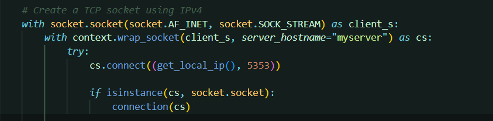
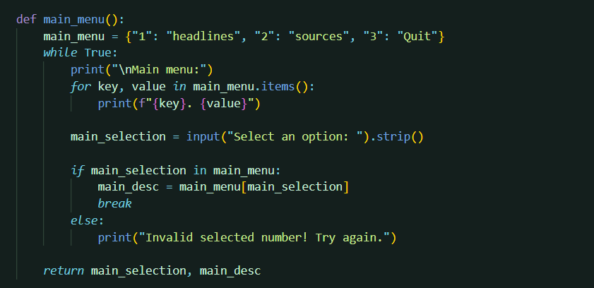
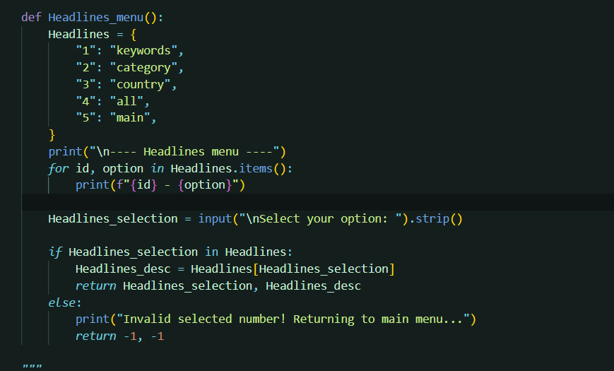

# Multithreaded News Client/Server Information System

## Project Description
The Multithreaded News Client/Server is a simple Information System that aims to enable a secure exchange of information about recent news between clients and the server. 
The server retrieves the news from https://newsapi.org/ depending on the client's request, where it can manage the connection with multiple clients in the same time.
However, the system provides the user with a menu so it can choose between headlines and sources easily and provide a detailed response if required.

## Semester
S1 2024-2025

## Group
**Group name**: B4
**Course Code:** ITNE352  
**Section:** 02  
**Students:**  
Israa Isa Ahmed Altaitoon (ID: 202206492)  
Zainab Hasan Isa Alobed (ID: 202206986)

## Table of Contents
1. [Requirements](#requirements)
2. [How to](#how-to-run-the-system)
3. [The Scripts](#the-scripts)
4. [Additional Concepts](#additional-concepts)
5. [Acknowledgments](#acknowledgments)
6. [Conclusion](#conclusion)
7. [Resources](#resources)

## Requirements
Follow these steps to set up the project locally:

1) Clone the repository:  
   ```bash
   git clone https://github.com/Zainab-Alobed/ITNE352-Project-Group-B4

2) Install required libraries:
 ```bash
   pip install -r required.txt
```
3) Run the server.py
```bash
    python server.py
```
4) Run the client.py
```bash
    python client.py
```
## How to run the system:
**Run the server:**

1) Navigate to the server directory:
```bash
    cd server
```
2) Start the server:
```bash
    python server.py 
```
**Run the client:**

1) Navigate to the client directory:
```bash
    cd client
```
2) Start the client:
```bash
    python client.py
```
**Interacting with the server:**

1) The user will be asked about his name, and send it to the server

2) The main menu will be displayed in client side that contains three options (the user must input a valid number 1-3):

1. Headlines 
2. Sources
3. Quit

3) A submenu of either headlines or sources will be displayed depending on the user choice

4) Later on, a maximum of 15 article will be displayed to provide the user the ability to request detailed information or go back to the main menu (Each request will be directly send to the server and print the response back in the client side)

5) The user can select (3) Quit to terminate the program

## The scripts

**Client script**
- Purpose:  
interaction with server (Sends the user requests to the server and displays response)

- External packages used:  
requests==2.32.3

- Main functionalities:

1. Create a TCP socket using IPv4 to connect to the server



2. Ask the user about his name and send it to the server


3. Display the main menu. Then, display either (1) Headlines menu or (2) Sources menu or (3) Quit depending on the user choice



4. If not (3) Send the request and recieve/display the response from the server (allow the request of detailed response)




**Server script**

**Additional functions that used in both client and server side**

- get_local_ip():
A function for retrieving the local IP of the device. 
The IP address retrieved by this function is assigned for internal use(not public). It works by contacting 8.8.8.8 which is Google’s public DNS server with a UDP socket where no need for sending data, this step is just to determine which network interface is being used. 
After creating the socket connect it to the DNS server. We can get the IP address using s.getsockname() which returns a tuple of the IP address and port number. s.getsockname()[0] will be the local IP address that we need. 
Finally, the method returns the IP address.

## Additional Concepts


**TLS\SSL (security)**


## Acknowledgments
We would like to thank our instructor for providing this project so we can learn how to implement a python network system.
Moreover, a big think to NewsAPI for providing the news.

## Conclusion
This project demonstrates how secure connections, API integration, Sockects, and client-server communication can be practically implemented using a Python network application.

The development of the Multithreaded News Client/Server Information System helped us learn concepts of: 
- Network programming (Python)
- API integration
- Multi-threaded
- client\server framework

## Resources
- API: https://newsapi.org/


